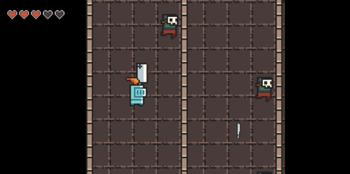

# AeroCrunch for Nintendo 3DS

**About**: 
Code game engine for Nintendo 3DS.

 

**What AeroCrunch used:**
1. citro3d for talk with 3DS 3D GPU
2. citro2d - for talk with 3DS 2D GPU
3. Dungeon tileset II by 0x72 - https://0x72.itch.io/dungeontileset-ii

**Other:** *Need rewrite later, created for creating games with lite for read code.*
